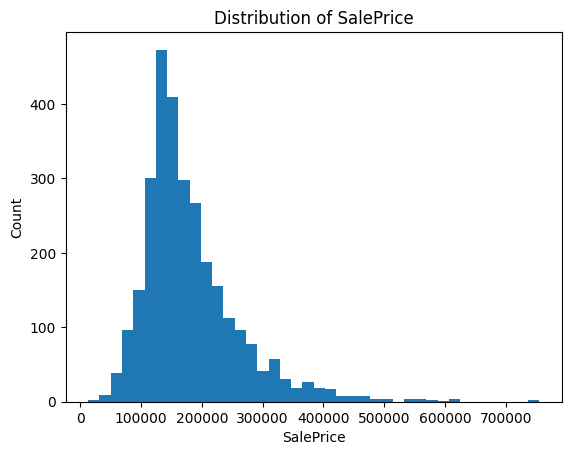
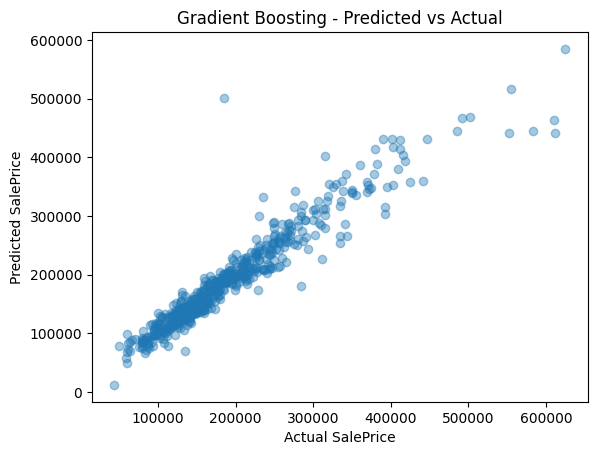
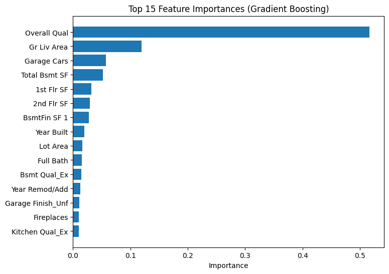

# House Price Prediction Using Machine Learning (Ames Housing)

## Project Overview
This project builds a machine learning regression model to predict **house sale prices** using property features such as living area, quality ratings, basement size, garage capacity, and renovation history.  
The objective is to estimate property value accurately and identify the strongest price drivers so buyers, sellers, and real estate professionals can make better decisions.

The project demonstrates an end-to-end supervised learning workflow with a focus on **model comparison, evaluation, and interpretability**.

---

## Dataset
**Ames Housing Dataset (Kaggle)**

Dataset link:  
https://www.kaggle.com/datasets/shashanknecrothapa/ames-housing-dataset?select=AmesHousing.csv

The dataset includes:

- Property size and layout details  
- Basement and garage characteristics  
- Year built and remodel year  
- Quality ratings for kitchen, basement, and overall condition  
- Neighborhood and building-related features  

**Target variable:** `SalePrice` (continuous)

---

## Approach / Methodology
This project follows a clean ML pipeline designed to prevent data leakage and keep results reproducible.

---

Project workflow:

- Load dataset + basic validation  
- EDA (distribution of SalePrice, missing values)  
- Train/Test split (80/20)  
- Preprocessing pipeline (numeric + categorical)  
- Model training and comparison  
- Final evaluation (RMSE + R²)  
- Feature importance and interpretation  
- Predicted vs Actual visualization  

---

## Final Results (Metrics & Top Insights)

### Model Performance Summary (Test Set)

| Model | RMSE | R² |
|------|------:|---:|
| **Gradient Boosting Regressor** | **26,730.80** | **0.911** |
| Random Forest Regressor | 26,731.76 | 0.911 |
| Ridge Regression | 29,160.83 | 0.894 |
| Lasso Regression | 29,257.88 | 0.893 |
| Linear Regression | 29,635.36 | 0.890 |

**Final Model:** Gradient Boosting Regressor  
**Best Test RMSE:** 26,730.80  
**Best Test R²:** 0.911  

**Top insights from results:**
- The model explains about **91% of the variance** in sale price on unseen test data.
- Tree-based models (Gradient Boosting / Random Forest) outperform linear models.
- Property **quality and usable living space** dominate price prediction.

---

## Key Insights
The best-performing model identifies these as the strongest drivers of house prices:

- **Overall Quality** is the #1 price driver by a large margin.
- **Above-ground living area** strongly increases sale price.
- **Garage capacity** contributes major value in many homes.
- **Basement total area** and finished basement space add value.
- **1st and 2nd floor size** matter more than many smaller features.
- **Year built and remodel year** show that newer/upgraded homes sell for more.
- Premium features like **excellent kitchen quality** and **basement quality** increase price.

---

## Business / Application Relevance

This project is useful for real-world real estate pricing and decision-making:

- **Buyers:** estimate fair price and avoid overpaying  
- **Sellers:** identify upgrades that increase value the most (quality, space, garage)  
- **Agents:** support pricing strategy with data-backed estimates  
- **Investors:** evaluate renovation impact and potential resale value  
- **Analysts:** understand price drivers in residential markets  

---

## Charts Preview

**SalePrice Distribution**

**Predicted vs Actual**

**Top Feature Importances**

